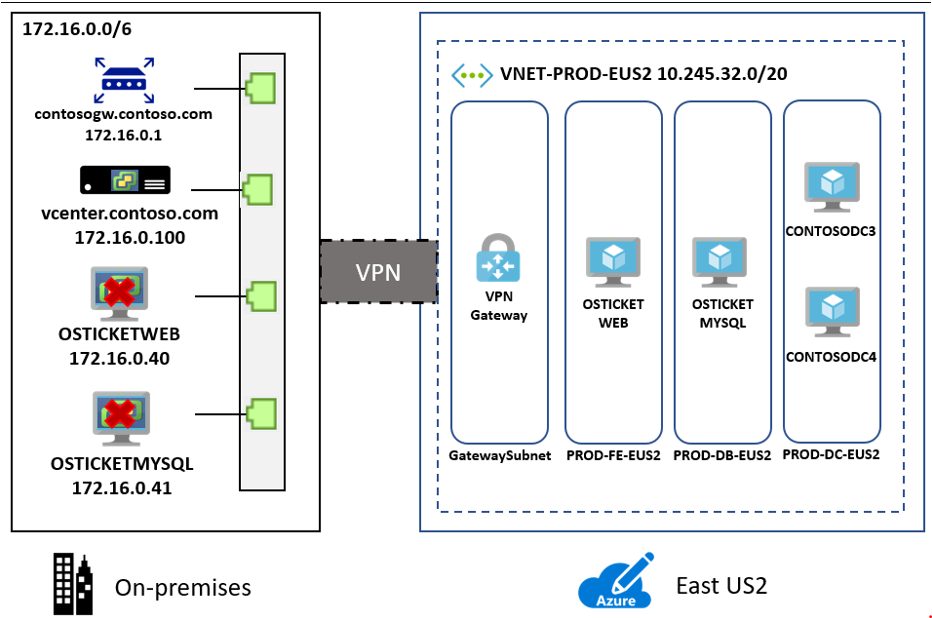
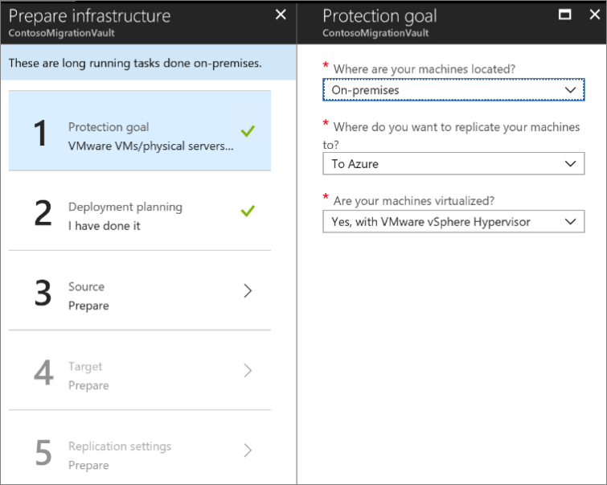
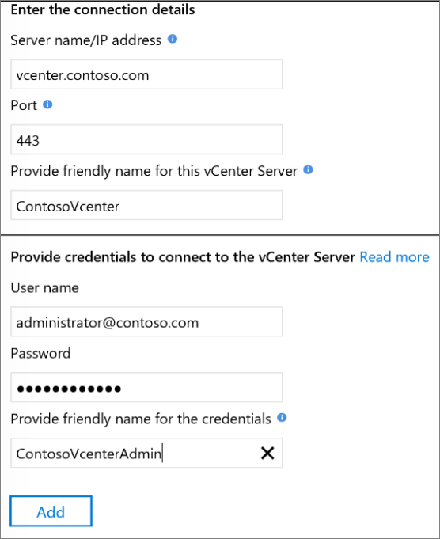
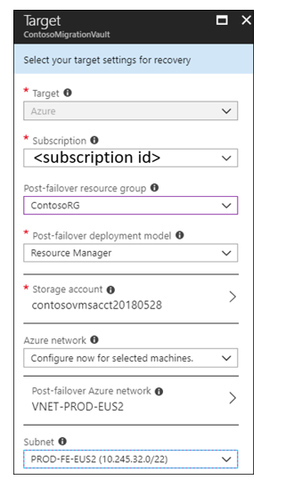
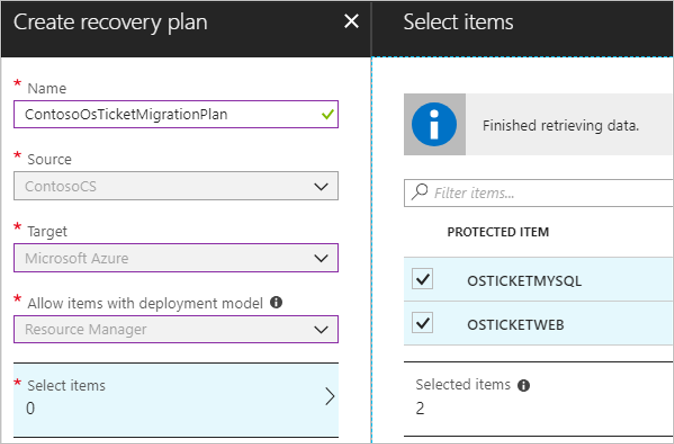
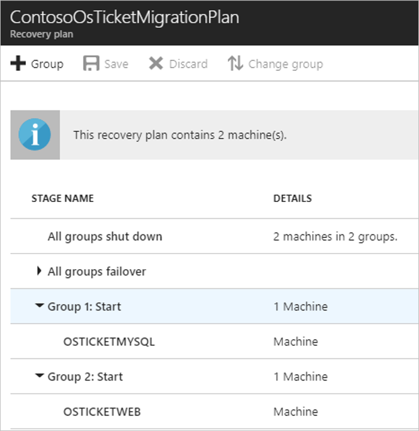
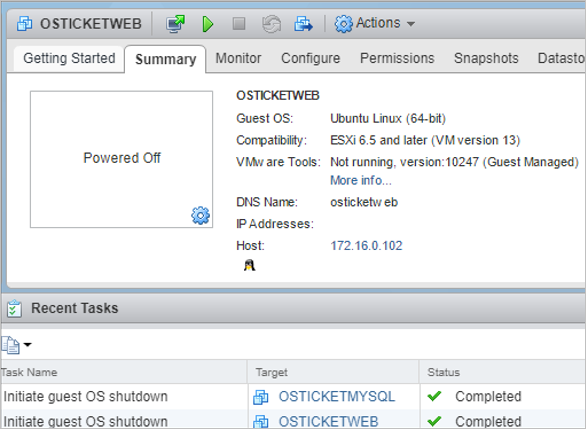
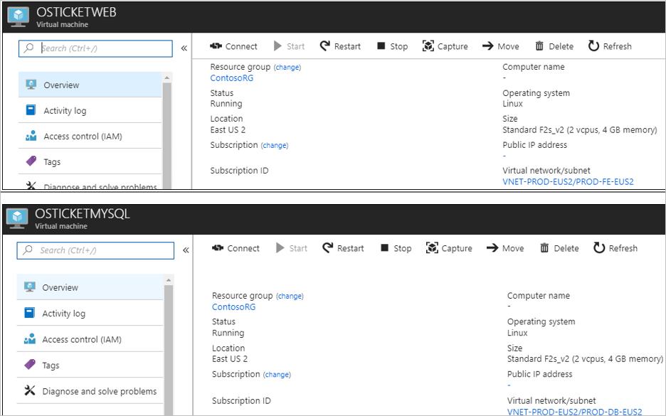
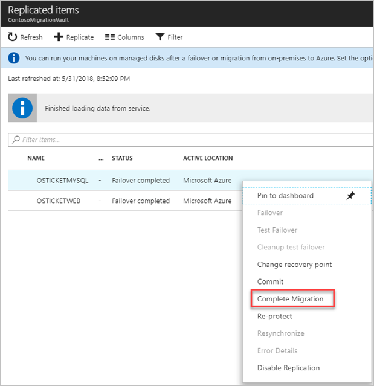

# Contoso series: Rehost (migrate) an on-premises app to Azure VMs 

This article shows Contoso are rehosting their on-premises two-tier Linux Apache MySQL PHP (LAMP)service desk app (osTicket) by migrating it to Azure, using the Azure Site Recovery service. If you'd like to try out the open source app used in this article, you can download it from [github](https://github.com/osTicket/osTicket).

This document is one in a series of articles that document how the fictitious company Contoso migrates their on-premises resources to the Microsoft Azure cloud. The series includes background information, and a series of scenarios that illustrate how to set up a migration infrastructure, assess the suitability of on-premises resources for migration, and run different types of migrations. Scenarios grow in complexity, and we'll be adding additional articles over time.

**Article** | **Migration type** | **Details**
--- | --- | --- 
[1. Overview](contoso-migration-overview.md) | All scenarios | Get an overview of migration strategies and the Contoso migration scenarios.
[2. Deploy a migration infrastructure](contoso-migration-infrastructure.md) | All scenarios | Learn about the infrastructure components and settings that Contoso needs to put in place for their migration.
[3. Assess resources for migration](contoso-migration-assessment) | All scenarios | Assess your on-premises resources to figure if they're ready for migration to Azure.
[4. Migrate to an Azure VM and Azure SQL Managed Instance](contoso-migration-rehost-vm-sql-managed-instance.md) | Rehost (lift-and-shift) | In our first article that shows how to rehost apps on Azure without reconfiguring them, Contoso performs a simple lift-and-shift migration for their tiered on-premises SmartHotel appIn this scenario, Contoso migrates the app frontend VM to an Azure VM, and the app database to an Azure SQL Managed Instance.
[5. Migrate to Azure VMs and SQL Server AlwaysOn availability group](contoso-migration-rehost-vm-sql-ag.md) | Rehost (lift-and-shift) | In the second of our rehosting articles,  Contoso migrates their tiered on-premises SmartHotel app to Azure VMs. The frontend VM is migrated using the Azure Site Recovery service. The database VM is migrated using the Database Migration Assistant, and runs in Azure on SQL cluster with SQL AlwaysOn availability group.
Migrate a Linux app to Azure VMs (this article) | Rehost (lift-and-shift) | In this article, Contoso rehosts a two-tier Linux app using Azure Site Recovery. 

## Business drivers

The IT Leadership team has worked closely with their business partners to understand what the business wants to achieve with this migration:

- **Address business growth**: Contoso is growing and as a result there is pressure on their on-premises systems and infrastructure.
- **Limit risk**: The service desk app is critical for the Contoso business. They want to move it to Azure with zero risk.
- **Extend**:  Contoso doesn't want to modify the app. They simply want to ensure that it's stable.

## Migration goals

The Contoso cloud team has pinned down goals for this migration. These goals are used to determine the best migration method:

- After migration, the app in Azure should have the same performance capabilities as it does today in their on-premises VMWare environment.  The app will remain as critical in the cloud as it is on-premises. 
- Contoso doesn’t want to invest in this app.  It is critical and important to the business, but in its current form they simply want to move it safely to the cloud.
- Contoso doesn't want to change the ops model for this app. They want to continue to interact with it in the cloud in the same way that they do now.
- Contoso doesn't want to change app functionality. Only the app location will change.
- Having completed a couple of Windows app migrations, Contoso wants to learn how to use a Linux-based infrastructure in the Azure cloud.

## Proposed architecture

In this scenario:

- Contoso wants to migrate their two-tier on-premises service desk app.
- The app is tiered across two VMs (OSTICKETWEB and OSTICKETMYSQL). The VMs are located on VMware ESXi host **contosohost1.contoso.com** (version 6.5).
- The VMware environment is managed by vCenter Server 6.5 (**vcenter.contoso.com**), running on a VM.
- They'll migrate both the app VMs to Azure.
- Since both VMs are production workloads, they will reside in the production resource group ContosoRG.
- The VMs will be replicated to the primary region (East US 2) and placed in the production network (VNET-PROD-EUS2) and subnet (PROD-FE-EUS2).
- Contoso has an on-premises datacenter (contoso-datacenter), with an on-premises domain controller (**contosodc1**).
- The on-premises VMs in the Contoso datacenter will be decommissioned after the migration is done.

 

### Azure services

**Service** | **Description** | **Cost**
--- | --- | ---
[Azure Site Recovery](https://docs.microsoft.com/azure/site-recovery/) | The service orchestrates and manages migration and disaster recovery for Azure VMs, and on-premises VMs and physical servers.  | During replication to Azure, Azure Storage charges are incurred.  Azure VMs are created, and incur charges, when failover occurs. [Learn more](https://azure.microsoft.com/pricing/details/site-recovery/) about charges and pricing.

 

## Migration process

Contoso will migrate the two VMs running their tiered Linux service desk application to Azure.

1. Contoso already have their Azure infrastructure in place, so they need to add a couple of Azure components for this scenario, prepare their on-premises VMware environment, and enable replication for the VMs.
2. After VMs are replicating to Azure, they'll migrate the VMs to Azure by running a failover from their on-premises site.

DIAGRAM TBD

## Prerequisites

If you want to run this scenario, here's what you should have.

**Requirements** | **Details**
--- | ---
**Azure subscription** | You should have already created a subscription during early articles in this series. If you don't have an Azure subscription, create a [free account](https://azure.microsoft.com/pricing/free-trial/).   If you create a free account, you're the administrator of your subscription and can perform all actions.   If you use an existing subscription and you're not the administrator, you need to work with the admin to assign you Owner or Contributor permissions.   If you need more granular permissions, review [this article](../site-recovery/site-recovery-role-based-linked-access-control.md). 
**Azure infrastructure** | Contoso set up their Azure infrastrcture as described in [Azure infrastructure for migration](migrate-scenarios-infrastructure.md).   Learn more about specific [network](https://docs.microsoft.com/azure/site-recovery/vmware-physical-azure-support-matrix#network) and [storage](https://docs.microsoft.com/azure/site-recovery/vmware-physical-azure-support-matrix#storage) requirements for Site Recovery.
**On-premises servers** | Your on-premises vCenter server should be running version 5.5, 6.0, or 6.5   An ESXi host running version 5.5, 6.0 or 6.5   One or more VMware VMs running on the ESXi host.
**On-premises VMs** | [Review Linux machines](https://docs.microsoft.com//azure/site-recovery/vmware-physical-azure-support-matrix#replicated-machines) that are supported for migration with Site Recovery.   Verify supported [Linux file and storage systems](https://docs.microsoft.com/azure/site-recovery/vmware-physical-azure-support-matrix#linux-file-systemsguest-storage).   VMs must meet [Azure requirements](https://docs.microsoft.com/azure/site-recovery/vmware-physical-azure-support-matrix#azure-vm-requirements).

## Scenario steps

Here's what we're going to do for this migration:

> [!div class="checklist"]
> * **Step 1: Prepare Azure for Site Recovery**: You create an Azure storage account to hold replicated data, and create a Recovery Services vault.
> * **Step 2: Prepare on-premises VMware for Site Recovery**: You prepare accounts for VM discovery and agent installation, and prepare to connect to Azure VMs after failover.
> * **Step 3: Replicate VMs**: You configure the Site Recovery source and target environment, set up a replication policy, and start replicating VMs to Azure storage.
> * **Step 4: Migrate the VMs with Site Recovery**: Run a test failover to make sure everything's working, and then run a full failover to migrate the VMs to Azure.

## Step 1: Prepare Azure for the Site Recovery service

There are a number of elements you need in Azure for Site Recovery:

- A VNet in which failed over resources are located.
- An Azure storage account to hold replicated data. 
- A Recovery Services vault in Azure.

Contoso are planning to migrate their web tier VM (WEBVM) and database VM (SQLVM) to Azure using Site Recovery. They set up Site Recovery as follows:

1. Since the VMs host the SmartHotel app, they will fail them over to their production network, in the primary East US 2 region. Both VMs will be in the ContosoRG resource group. This is the resource group Contoso uses for production resources.

    - OSTICKETWEB, containing the app frontend, will migrate to the frontend subnet (PROD-FE-EUS2), in the production network (VNET-PROD-EUS2).
    - OSTICKETMYSQL, containing the database, will migrate to the database subnet (PROD-DB-EUS2), in the production network (VNET-PROD-EUS2).
2. Contoso create an Azure storage acount (contosovmsacc20180528) in the East US 2 region. The storage account must be in the same region as the Recovery Services vault. They're using a general purpose account, with standard storage, and LRS replication. They 

    

3. With the network and storage account in place, Contoso create a vault (ContosoMigrationVault), and place it in the ContosoFailoverRG resource group, in the primary East US 2 region.

    

**Need more help?**

[Learn about](https://docs.microsoft.com/azure/site-recovery/tutorial-prepare-azure) setting up Azure for Site Recovery.

## Step 2: Prepare on-premises VMware for Site Recovery

To prepare VMware for Site Recovery, here's what you need to do:

- Prepare an account on the vCenter server or vSphere ESXi host, to automate VM discovery.
- Prepare an account that allows automatic installation of the Mobility service on VMware VMs that you want to replicate.
- Prepare on-premises VMs, if you want to connect to Azure VMs when they're created after failover.

### Prepare an account for automatic discovery

Site Recovery needs access to VMware servers to:

- Automatically discover VMs. At least a read-only account is required.
- Orchestrate replication, failover, and failback. You need an account that can run operations such as creating and removing disks, and turning on VMs.

Contoso sets up the account as follows:

1. Contoso creates a role at the vCenter level.
2. Contoso then assigns that role the required permissions.

**Need more help?**

[Learn about](https://docs.microsoft.com/azure/site-recovery/vmware-azure-tutorial-prepare-on-premises#prepare-an-account-for-automatic-discovery) creating and assigning a role for automatic discovery.

### Prepare an account for Mobility service installation

The Mobility service must be installed on the VM you want to replicate.

- Site Recovery can do an automatic push installation of this component when you enable replication for the VMs.
- For automatic push installation, you need to prepare an account that Site Recovery will use to access the VMs.
- You specify this account when you set up replication in the Azure console.
- You need a domain or local account with permissions to install on the VMs.

**Need more help**

[Learn about](https://docs.microsoft.com/azure/site-recovery/vmware-azure-tutorial-prepare-on-premises#prepare-an-account-for-mobility-service-installation) creating an account for push installation of the Mobility service.

### Prepare to connect to Azure VMs after failover

After failover to Azure, Contoso wants to be able to connect to the replicated VMs in Azure. To do this, there's a couple of things they need to do on the on-premises VM, before they run the migration: 

- To access over the internet, enable SSH on the on-premises Linux VM before failover.  For Ubuntu this can be completed using the following command: **Sudo apt-get ssh install -y**.

In addition, when they run a failover they need to check the following:

- After failover, they should check **Boot diagnostics** to view a screenshot of the VM. If this doesn't work, they should check that the VM is running and review these [troubleshooting tips](http://social.technet.microsoft.com/wiki/contents/articles/31666.troubleshooting-remote-desktop-connection-after-failover-using-asr.aspx).

## Step 3: Replicate the on-premises VMs

Before they can run a migration to Azure, Contoso need to set up replication, and enable replication for their on-premises VM.

### Set a replication goal

1. In the vault, under the vault name (ContosoVMVault) they set a replication goal (**Getting Started** > **Site Recovery** > **PRepare infrastructure**.
2. They specify that their machines are located on-premises, that they're VMware VMs, and that they want to replicate to Azure.

    

### Confirm deployment planning

To continue, they need to confirm that they have completed deployment planning, by selecting **Yes, I have done it**.

### Set up the source environment

Now they need to configure their source environment. To do this they download an OVF template and used it to deploy the configuration server and its associated components as a highly available, on-premises VMware VM. Components on the server include:

- The configuration server that coordinates communications between on-premises and Azure and manages data replication.
- The process server that acts as a replication gateway. It receives replication data; optimizes it with caching, compression, and encryption; and sends it to Azure storage.
- The process server also installs Mobility Service on VMs you want to replicate and performs automatic discovery of on-premises VMware VMs.

After the configuration server VM is created and started, they register it in the vault.

Contoso perform these steps as follows:

1. They download the OVF template from **Prepare Infrastructure** > **Source** > **Configuration Server**.
    
    

2. They import the template into VMware to create the VM, and deploy the VM.

    

3.  When they turn on the VM for the first time, it boots up into a Windows Server 2016 installation experience. They accept the license agreement, and enter an administrator password.

4. After the installation finishes, they sign in to the VM as the administrator. At first-time sign in, the Azure Site Recovery Configuration Tool runs by default.
5. In the tool, they specify a name to use for registering the configuration server in the vault.
6. The tool checks that the VM can connect to Azure. After the connection is established, select **Sign in** to sign in to your Azure subscription. The credentials must have access to the vault in which you want to register the configuration server.

    [Register configuration server](./media/contoso-migration-rehost-linux-vm/config-server-register2.png)

7. The tool performs some configuration tasks and then reboots. They sign in to the machine again, and the configuration server management wizard starts automatically.
8. In the Configuration Server Management wizard, they select the NIC to receive replication traffic. This setting can't be changed after it's configured.
9. They select the subscription, resource group, and vault in which to register the configuration server.
         

10. They then download and install MySQL Server, and VMWare PowerCLI. Then validate the server settings.
11. After settings are validated, they specify the FQDN or IP address of the vCenter server or vSphere host, on which the VM is located. They leave the default port, and specify a friendly name for the vCenter server in Azure.
12. They need to specify the account that they created earlier, so that Site Recovery can automatically discover VMware VMs that are available for replication. 
13. They then specify the credentials that are used to automatically install Mobility Service on machines, when replication is enabled. For Windows machines, the account needs local administrator privileges on the machines you want to replicate. 

    

7. After registration finishes, in the Azure portal, Contoso double checks that the configuration server and VMware server are listed on the **Source** page in the vault. Discovery can take 15 minutes or more. 
8. Site Recovery then connects to VMware servers using the specified settings and discovers VMs.

### Set up the target

Now Contoso needs to specify their target replication environment.

1. In **Prepare infrastructure** > **Target**, they select the target settings.
2. Site Recovery checks that there's a Azure storage account and network in the specified target.

### Create a replication policy

After the source and target are set up, Contoso is ready to create a replication policy, and associate it with the configuration server.

1. In  **Prepare infrastructure** > **Replication Settings** > **Replication Policy** >  **Create and Associate**, they create a policy **ContosoMigrationPolicy**.
2. They use the default settings:
    - **RPO threshold**: Default of 60 minutes. This value defines how often recovery points are created. An alert is generated if continuous replication exceeds this limit.
    - **Recovery point retention**. Default of 24 hours. This value specifies how long the retention window is for each recovery point. Replicated VMs can be recovered to any point in a window.
    - **App-consistent snapshot frequency**. Default of one hour. This value specifies the frequency at which application-consistent snapshots are created.
 
        

5. The policy is automatically associated with the configuration server. 

    

### Install the guest agent

Before you migrate to Azure, the VMs need the Azure Guest agent installed. This agent allows the VMs to become Azure VMs. Without this agent, the VMs will be unreachable and Contoso won't be able to work with them.

- On each VM, run this command to install the agent: **sudo ap-teg install walinuxagent -y**.

**Need more help?**

- You can read a full walkthrough of all these steps in [Set up disaster recovery for on-premises VMware VMs](https://docs.microsoft.com/azure/site-recovery/vmware-azure-tutorial).
- Detailed instructions are available to help you [set up the source environment](https://docs.microsoft.com/azure/site-recovery/vmware-azure-set-up-source), [deploy the configuration server](https://docs.microsoft.com/azure/site-recovery/vmware-azure-deploy-configuration-server), and [configure replication settings](https://docs.microsoft.com/azure/site-recovery/vmware-azure-set-up-replication).
- [Learn more](https://docs.microsoft.com/azure/virtual-machines/extensions/agent-linux) about the Azure Guest agent for Linux.

### Enable replication for OSTICKETWEB

Now Contoso can start replicating the OSTICKETWEB VM.

1. In **Replicate application** > **Source** > **+Replicate** they select the source settings.
2. They select that they want to enable virtual machines, select the source settings, including the vCenter server, and the configuration server.

    

3. Now, they specify the target settings, including the resource group in which the Azure VM will be located after failover, the storage account in which replicated data will be stored, and the Azure network/subnet in which the Azure VM will be located when it's created after failover. 

     

3. Contoso selects OSTICKETWEB for replication. 

    - At this stage Contoso selects only OSTICKETWEB because VNet and subnet must be selected,and the VMs aren't in the same subnet.
    - Site Recovery automatically installs the Mobility service when replication is enabled for the VM.

    

4. In the VM properties, Contoso select the account that's used by the process server to automatically install Mobility Service on the machine.

     

5. in **Replication settings** > **Configure replication settings**, they check that the correct replication policy is applied, and select **Enable Replication**.
6.  They track replication progress in **Jobs**. After the **Finalize Protection** job runs, the machine is ready for failover.

### Enable replication for OSTICKETMYSQL

Now Contoso can start replicating OSTICKETMYSQL.

1. In **Replicate application** > **Source** > **+Replicate** they select the source and target settings.
2. Contoso selects OSTICKETMYSQL for replication, and selects the account to use for Site Recovery to install the Mobility service when replication is enabled for the VM

    

3. Contoso applies the same replication policy that was used for OSTICKETWEB, and enables replication.  

**Need more help?**

You can read a full walkthrough of all these steps in [Enable replication](https://docs.microsoft.com/azure/site-recovery/vmware-azure-enable-replication).

## Step 4: Migrate the VMs 

Contoso run a quick test failover, and then migrate the VMs.

### Run a test failover

Before migrating the VMs, Contoso run a test failover to make sure that everything's working as expected. 

1. Contoso runs a test failover, to the latest available point in time (Latest processed).
2. They select **Shut down machine before beginning failover**, so that Site Recovery attempts to shut down the source VM before triggering the failover. Failover continues even if shutdown fails. 
3. Test failover runs: 

    - A prerequisites check runs to make sure all of the conditions required for migration are in place.
    - Failover processes the data, so that an Azure VM can be created. If select the latest recovery point, a recovery point is created from the data.
    - An Azure VM is created using the data processed in the previous step.
3. After the failover finishes, the replica Azure VM appears in the Azure portal. Contoso checks that everything is working properly. The VM is the appropriate size,  it's connected to the right network, and it's running. 
4. After verifying the test failover, Contoso clean up the failover, and record and save any observations. 

### Create and customize a recovery plan

 After verifying that the test failover worked as expected, Contoso create a recovery plan for migration. 

- A recovery plan specifies the order in which failover occurs, how Azure VMs will be brought up in Azure.
- Since they want to migrate a two-tier app, they'll customize the recovery plan so that the data VM (SQLVM) starts before the frontend (WEBVM).

1. In **Recovery Plans (Site Recovery)** > **+Recovery Plan**, they create a plan and add the VMs to it.

    

2. After creating the plan, they select it for customization (**Recovery Plans** > **OsTicketMigrationPlan** > **Customize**.
3.	They remove OSTICKETWEB from **Group 1: Start**.  This ensures that the first start action affects OSTICKETMYSQL only.

    

4.	In **+Group** > **Add protected items**, they add OSTICKETWEB to Group 2: Start.  Contoso needs these to be in two different groups.

    

### Migrate the VMs

Now Contoso are ready to run a failover on the recovery plan, to migrate the VMs.

1. They select the plan > **Failover**.
2.  They select to fail over to the latest recovery point, and specify that Site Recovery should try to shut down the on-premises VM before triggering the failover. They can follow the failover progress on the **Jobs** page.

    

3. During the failover, vCenter Server issues commands to stop the two VMs running on the ESXi host.

    

3. After the failover, Contoso verify that the Azure VM appears as expected in the Azure portal.

      

3. After verifying the VM in Azure, they complete the migration to finish the migration process for each VM. This stops replication for the VM, and stop Site Recovery billing for the VM.

    

**Need more help?**

- [Learn about](https://docs.microsoft.com/azure/site-recovery/tutorial-dr-drill-azure) running a test failover. 
- [Learn](https://docs.microsoft.com/azure/site-recovery/site-recovery-create-recovery-plans) how to create a recovery plan.
- [Learn about](https://docs.microsoft.com/azure/site-recovery/site-recovery-failover) failing over to Azure.

## Step 5: Clean up after migration

With migration complete, the SmartHotel app tiers are running on Azure VMs.

Now, Contoso needs to do some cleanup:  

- They remove OSTICKETWEB ad OSTICKETMYSQL VMs from the vCenter inventory.
- They remove the on-premises VMs from local backup jobs.
- They update their internal documentation show the new location, and IP addresses for STICKETWEB ad OSTICKETMYSQL.
- They review any resources that interact with the VMs, and update any relevant settings or documentation to reflect the new configuration.

## Step 9: Review the deployment

With the app now running, Contoso need to fully operationalize and secure their new infrastructure.

### Security

The Contoso security team review the OSTICKETWEB and OSTICKETMYSQL VMs to determine any security issues.

- They review the Network Security Groups (NSGs) for the VMs to control access. NSGs are used to ensure that only traffic allowed to the application can pass.
- They are also considering securing the data on the VM disks using Disk encryption and Azure KeyVault.

[Read more](https://docs.microsoft.com/azure/security/azure-security-best-practices-vms#vm-authentication-and-access-control) about security practices for VMs.

### Backups

Azure are going to back up the data on the VMs using the Azure Backup service. [Learn more](https://docs.microsoft.com/azure/backup/backup-introduction-to-azure-backup?toc=%2fazure%2fvirtual-machines%2flinux%2ftoc.json).

### Licensing and cost optimization

1. Contoso has no licensing issues with their Ubuntu servers.

2. Contoso will enable Azure Cost Management licensed by Cloudyn, a Microsoft subsidiary. It's a multi-cloud cost management solution that helps you to utilize and manage Azure and other cloud resources.  [Learn more](https://docs.microsoft.com/azure/cost-management/overview) about Azure Cost Management. 

## Next steps

In this scenario we showed the fourth scenario in the Contoso rehost (lift-and-shift) migration series. We migrated an on-premises service desk app tiered over two Linux VMs to Azure.

In the fifth article in the series, we'll show how Contoso migrate the same service desk app to Azure, using Site Recovery to migrate the frontend VM for the app, and migrating the app database using backup and restore to Azure Database for MySQL, using the MySQL workbench tool.
